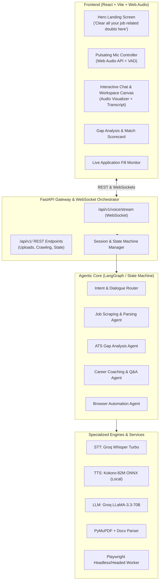
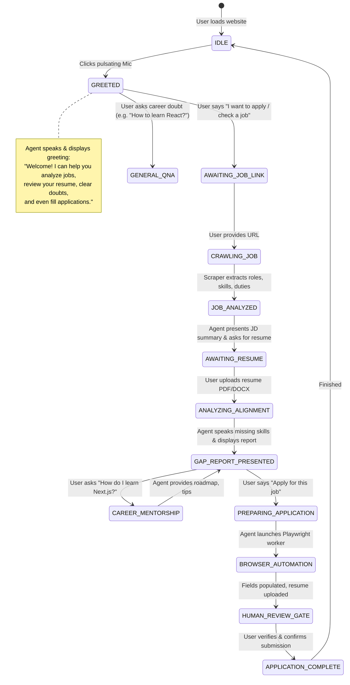
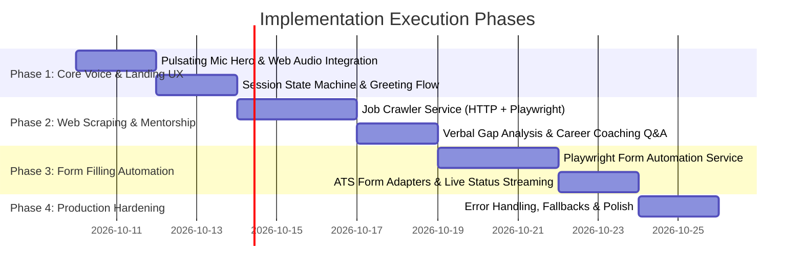

# Architecture & Production Design: Voice-First AI Career & Application Co-Pilot

> **Document Version**: 1.0.0  
> **Target Status**: Production-Ready Blueprint  
> **Author**: AI Systems Architect  
> **Workspace**: `ai-recruitment-assistant`

---

## 1. Executive Summary & Paradigm Shift

The project is undergoing a fundamental evolution:
- **From**: A static, form-based document comparison tool (uploading two PDFs onto a static dashboard).
- **To**: A **Voice-First Autonomous Career & Job Application Co-Pilot** that functions like an intelligent, empathetic career agent and recruiter assistant.

### Core User Journey
1. **Landing & Warm Greeting**: Clean, modern landing page featuring the hero text:  
   *"Clear all your job related doubts here"* with a central, pulsating voice microphone button.
2. **Interactive Voice Activation**: Clicking the microphone triggers an spoken audio & text greeting explaining its core powers:
   - Helping discover and analyze job opportunities.
   - Analyzing candidate resumes against live job requirements.
   - Clarifying career doubts, tech stacks, and learning roadmaps.
   - Automating the application form-filling process on external job portals.
3. **Job URL Ingestion & Crawling**: The user requests to apply or evaluate a role; the agent prompts for the job link, deploys an intelligent crawler, extracts roles & responsibilities, and provides a preliminary fit assessment.
4. **Resume Ingestion & Gap Analysis**: The agent prompts for the candidate's resume, executes deep ATS-style alignment, displays an interactive scorecard, and **verbally articulates what critical skills and experiences are missing**.
5. **Interactive Mentorship**: The candidate can converse naturally via voice or text (e.g., *"How do I learn Next.js?", "What projects should I build to bridge this gap?"*).
6. **Agentic Browser Automation (Form Filling)**: Upon candidate instruction (*"Please apply for this job"*), the agent launches an automated browser agent to navigate the job portal, populate fields using the candidate's profile/resume, upload the document, and guide the user through submission with human-in-the-loop oversight.

---

## 2. Detour Analysis: Current State vs. Target Architecture

An objective audit of the current workspace against the new requirements reveals where we have existing leverage and where significant new development is required.

| Component / Subsystem | Current Status in Repo | Reusability / Effort | Target Transformation |
| :--- | :--- | :--- | :--- |
| **Voice Synthesis (TTS)** | Kokoro-82M ONNX implemented (`tts_service.py`) | **High (85% reusable)** | Already fast & zero-cost. Needs audio streaming support or chunked playback for rapid voice replies. |
| **Speech-to-Text (STT)** | Groq Whisper implemented (`stt_service.py`) | **High (80% reusable)** | Excellent transcription. Add client-side VAD (Voice Activity Detection) to avoid manual push-to-talk delays. |
| **LLM Reasoning Engine** | Groq LLaMA / OpenAI-compatible (`llm_service.py`) | **High (75% reusable)** | Needs stateful conversation management, tool-calling (function calling for crawler & browser), and session persistence. |
| **Resume & JD Parsing** | PyMuPDF text extractor (`pdf_parser.py`) | **Medium (50% reusable)** | Extractors exist for PDF; must support DOCX parsing and raw crawled HTML DOM sanitization. |
| **Matching & Gap Engine** | Skill normalizer & match engine (`matching_engine.py`) | **High (85% reusable)** | Works well for computing match scores and missing skills; needs integration into multi-turn conversational memory. |
| **Job Description Crawler** | Stub / Not implemented | **New Component (0%)** | Must build dual-tier crawler (Fast HTTP/Jina + Headless Playwright fallback) to bypass anti-bot scrapers. |
| **Browser Form Automation** | Empty stub (`browser_automation.py`) | **New Component (0%)** | Must build Playwright-based autonomous form filler with ATS adapters (Greenhouse, Lever, Ashby, Workday) and heuristic fallback. |
| **Conversational State Machine** | Stateless endpoints (`/greeting`, `/chat`) | **Refactor Needed (30%)** | Transition from stateless single-shot endpoints to a Session-backed State Machine / WebSocket pipeline. |
| **Frontend UI/UX** | Static 2-box upload dashboard (`App.jsx`) | **Refactor Needed (25%)** | Transform into a voice-first landing hero with a pulsing mic, dynamic slide-over / split-screen canvas for crawler preview, resume gap report, and live browser automation stream. |

### Overall Detour Metric
- **Foundation Reusability**: ~**40%** (TTS, STT, LLM connector, matching math, core schemas).
- **New Engineering Required**: ~**60%** (Job Crawler, Browser Automation Agent, Session State Machine, Voice-First Redesigned Frontend).

---

## 3. Architectural Opinions & Production Feasibility Warnings

Deploying autonomous voice agents and web-interacting agents into a **production environment** brings specific engineering risks that must be acknowledged and mitigated:

### Opinion 1: The Job Crawling Reality (Anti-Bot & Login Walls)
- **The Challenge**: Target job URLs range from public postings (Greenhouse, Lever, workable) to strictly walled or bot-protected sites (LinkedIn, Indeed, Workday, Glassdoor, Cloudflare turnstile).
- **Production Solution**: A **Dual-Tier Scraping Pipeline**:
  - **Tier 1 (Instant HTTP Reader)**: Use header-spoofed lightweight HTTP requests or readable content extractors (`trafilatura` / `BeautifulSoup` / Jina Reader API `https://r.jina.ai/<url>`). Succeeds in 70% of standard company career pages with sub-second latency.
  - **Tier 2 (Headless Browser Fallback)**: If blocked or dynamically rendered with React/Angular/Vue, dispatch a headless Playwright instance with anti-detect plugins (`playwright-stealth`) to extract the hydrated DOM.
  - **Tier 3 (Graceful Fallback)**: If a site enforces hard login authentication (e.g., private LinkedIn post), prompt the user: *"I couldn't bypass the login wall on this link. Could you paste the job description text or upload the JD PDF instead?"*

### Opinion 2: Autonomous Form Filling vs. "Semi-Autonomous Copilot"
- **The Challenge**: Full end-to-end autonomous form submission on arbitrary websites is prone to catastrophic failures: CAPTCHAs, two-factor authentication, unexpected custom questions ("Are you legally authorized?"), terms of service violations, and hallucinated candidate answers.
- **Production Solution**: **Semi-Autonomous Human-in-the-Loop Architecture**:
  1. The agent extracts candidate facts from the resume and creates a structured **Application Profile** (Name, Email, Phone, LinkedIn, GitHub, Years of Experience, Education, Work History, Resume File path).
  2. The agent fills out all standard input fields, selects dropdowns, and attaches the resume file via Playwright.
  3. When an unknown question or CAPTCHA is encountered, the agent pauses and asks the candidate via voice or text (*"They are asking for your expected CTC or visa sponsorship status. What should I fill?"*).
  4. **The Golden Rule for Production**: The agent **never clicks the final 'Submit Application' button autonomously** without explicit candidate confirmation. It navigates to the final review screen, takes a snapshot or leaves the session ready, and requests: *"I have filled out all 14 fields and attached your resume. Please review the summary and say 'Confirm Submit' or submit it directly."* This prevents legal liability and application errors.

### Opinion 3: Voice Interaction Latency & Pipeline
- **The Challenge**: Users expect voice responses within **1.0 to 1.5 seconds**. A sequential pipeline of `STT -> LLM reasoning -> Crawler/TTS -> Audio download` can easily take 6–8 seconds if not properly pipelined.
- **Production Solution**:
  - Keep Kokoro TTS locally cached in ONNX format (already operational in backend).
  - Use Groq Whisper (`whisper-large-v3-turbo`) for sub-300ms transcription.
  - Use Groq LLaMA 3.3 70B (`llama-3.3-70b-versatile`) for fast reasoning.
  - For long multi-step operations (e.g., crawling a page or opening Playwright), the voice agent **must provide immediate conversational filler audio** (e.g., *"I'm fetching that job posting right now, give me just two seconds..."*) before running the heavy async task.

### Opinion 4: Session State Management
- In production, voice conversations must maintain state across turns (e.g., the user might say *"Actually, what about the other skill?"* 3 turns after the resume was uploaded).
- An ephemeral in-memory state or Redis-backed session store is required to track:
  - `session_id`
  - `current_stage` (`IDLE`, `AWAITING_JOB_URL`, `CRAWLING_JD`, `AWAITING_RESUME`, `ANALYZING_GAP`, `CAREER_COACHING`, `FILLING_APPLICATION`)
  - `parsed_job` (extracted requirements, responsibilities)
  - `parsed_resume` (skills, experiences, candidate metadata)
  - `chat_history` (conversation turns)

---

## 4. Proposed System Architecture

### 4.1 High-Level Component Diagram



---

## 5. Detailed Conversational State Machine

The agent operates as a deterministic, session-aware state machine with natural conversational fallbacks.



---

## 6. Subsystem Specifications

### 6.1 Subsystem A: Frontend UX / UI Overhaul
- **Hero State**:
  - Minimalist, premium dark glassmorphism design.
  - Headline: *"Clear all your job related doubts here"*.
  - Subtitle: *"Your autonomous voice companion for resume alignment, technical upskilling, and hands-free job applications."*
  - Centerpiece: High-fidelity **Pulsating Voice Orb / Mic** with ripple soundwaves and glow effect.
- **Active Dialogue State**:
  - Smooth animation expands the hero into a split-screen workspace:
    - **Left Panel (Voice & Dialogue Hub)**: Live audio visualizer, turn-by-turn chat bubbles, mic mute/unmute, live transcription status indicator (`Listening...`, `Thinking...`, `Speaking...`).
    - **Right Panel (Action & Intelligence Canvas)**: Dynamically renders the current context:
      - *Stage 1*: Interactive URL Input bar with 1-click popular job board examples.
      - *Stage 2*: Crawled Job Card (Extracted company, title, required tech stack, responsibilities).
      - *Stage 3*: Resume Upload Dropzone (drag & drop PDF/DOCX).
      - *Stage 4*: ATS Fit Score, Matched Skills badge cloud, **Missing Skills warning pills**, and actionable advice.
      - *Stage 5*: Browser Form Automation Console (shows step-by-step progress: `Field detected: Full Name -> Filled`, `Uploaded: resume.pdf`, `Ready for review`).

### 6.2 Subsystem B: Job Description Crawler & Parser
- **Module**: `backend/app/services/job_crawler.py`
- **Supported Targets**: Greenhouse, Lever, Workday, SmartRecruiters, Ashby, company career sites, standard web links.
- **Strategy**:
  1. Validate URL syntax and domain.
  2. Attempt fast fetch via HTTP with realistic User-Agent headers and HTML readability extraction (`readability-lxml` or `trafilatura`).
  3. If content length is suspicious (<300 words) or indicates JS rendering, trigger Playwright headless page evaluation.
  4. Pass raw sanitized text to `job_agent.py` to extract structured schema:
     ```json
     {
       "job_title": "Senior Frontend Engineer",
       "company": "Acme Corp",
       "location": "Remote",
       "required_skills": ["React", "Next.js", "TypeScript", "Tailwind CSS"],
       "preferred_skills": ["GraphQL", "Docker", "Jest"],
       "responsibilities": ["Architect scalable web apps...", "Lead code reviews..."],
       "qualifications": ["4+ years experience with modern JavaScript frameworks..."],
       "application_url": "https://boards.greenhouse.io/acme/jobs/12345"
     }
     ```

### 6.3 Subsystem C: Speech & Real-Time Audio Pipeline
- **STT (Speech-to-Text)**:
  - Groq Whisper Large v3 Turbo via existing `stt_service.py`.
  - Frontend records WebM/Opus audio chunks via `MediaRecorder` or Web Audio API.
  - Client-side VAD (Voice Activity Detection) detects silence (e.g., 1.2s silence) to trigger auto-send without needing manual click-to-stop.
- **TTS (Text-to-Speech)**:
  - Local Kokoro-82M ONNX via existing `tts_service.py`.
  - Provides natural, expressive English voices (`af_heart`, `af_bella`, `am_adam`).
  - Text post-processing removes markdown symbols, tables, URLs, and code snippets before sending to TTS, ensuring smooth voice delivery.
  - Returns audio as base64 or raw audio buffer to play in the browser.

### 6.4 Subsystem D: Resume Ingestion & Comparative Gap Engine
- **Module**: `backend/app/services/pdf_parser.py` & `backend/app/services/matching_engine.py`
- **Enhancement**:
  - Support both PDF (PyMuPDF) and DOCX (`python-docx`).
  - Structured extraction via `cv_agent.py`: Candidate name, contact info, skills, work experience items, education, project highlights.
  - Deterministic alignment matrix:
    - Match Score = `0.7 * (required_skills_match) + 0.3 * (preferred_skills_match)`.
    - Returns `matched_skills`, `missing_skills`, and `recommendations`.
  - **Spoken Summary Prompt**: Generates a natural 2-sentence conversational voice breakdown focused on what the user needs to learn or add to their resume to get an interview.

### 6.5 Subsystem E: Career Mentorship & Upskilling Dialogue
- **Module**: `backend/app/agents/career_mentor_agent.py`
- Handles questions like *"How do I learn Next.js?", "Can you give me a roadmap?", "What should I say about missing Docker experience?"*.
- Prompt engineered with technical recruiter and staff engineer domain knowledge:
  - Provides concise 3-step learning milestones.
  - Suggests high-signal portfolio projects that prove competence to hiring managers.
  - Keeps voice replies punchy (<40 seconds of speech) while rendering detailed markdown roadmaps on the UI canvas.

### 6.6 Subsystem F: Browser Automation & Form-Filling Engine
- **Module**: `backend/app/services/browser_automation.py`
- **Technology**: Microsoft Playwright (Python async API).
- **Architecture**:
  1. **ATS Detection**: Recognizes standard URL patterns and DOM structures:
     - Greenhouse (`boards.greenhouse.io`, `api.greenhouse.io/v1/boards/...`)
     - Lever (`jobs.lever.co`)
     - Ashby (`jobs.ashbyhq.com`)
     - Generic HTML5 form fallback.
  2. **Field Mapper**:
     - Maps candidate fields to form selectors:
       - First Name / Last Name / Full Name (`input[name*="first_name"]`, `input[id*="name"]`, `input[autocomplete="name"]`)
       - Email (`input[type="email"]`, `input[name*="email"]`)
       - Phone (`input[type="tel"]`, `input[name*="phone"]`)
       - LinkedIn / GitHub / Portfolio URLs
       - Resume Attachment (`input[type="file"][accept*="pdf"]`)
  3. **Execution Modes**:
     - **Headed/Dev Mode**: Can open a visible browser window so the user sees the agent typing and clicking in real time.
     - **Server/Headless Mode**: Streams live execution step logs and screenshots over WebSocket to the frontend canvas.
  4. **Human Verification Gate**:
     - If custom long-form questions exist ("Why do you want to work here?"), the agent generates a tailored draft based on the resume and asks for candidate approval.
     - When all fields are populated, the agent stops before the submit button and requests confirmation.

---

## 7. Data Models & API Contract

### 7.1 Session State Schema
```python
class SessionState(BaseModel):
    session_id: str
    stage: str = "IDLE"  # IDLE | GREETED | AWAITING_JOB | AWAITING_RESUME | GAP_REVIEW | MENTORING | APPLYING
    candidate_profile: dict | None = None
    job_details: dict | None = None
    match_analysis: dict | None = None
    conversation_history: list[dict] = []
    application_task_id: str | None = None
```

### 7.2 REST / WebSocket Endpoints
| Endpoint | Method / Protocol | Description |
| :--- | :--- | :--- |
| `/api/v1/session/init` | `POST` | Initializes a new conversation session |
| `/api/v1/crawler/crawl-job` | `POST` | Takes `{url: string}`, scrapes and parses JD |
| `/api/v1/resume/upload` | `POST` (multipart) | Uploads resume PDF/DOCX, parses candidate profile |
| `/api/v1/matching/evaluate` | `POST` | Executes gap analysis between parsed JD & resume |
| `/api/v1/voice/greet` | `POST` | Returns opening spoken audio and welcome text |
| `/api/v1/voice/interact` | `POST` / `WS` | Multi-turn speech/text conversational turn |
| `/api/v1/application/fill` | `POST` | Triggers Playwright worker to fill application form |
| `/api/v1/application/status/{task_id}` | `GET` / `WS` | Real-time stream of form-filling steps & screenshots |

---

## 8. Reliability, Security & Production Hardening

1. **Security & Candidate Privacy**:
   - Resumes contain sensitive Personally Identifiable Information (PII) like phone numbers, home addresses, and emails.
   - Uploaded resumes must be stored in isolated, temporary session directories with automatic expiration (TTL = 1 hour).
   - Sensitive credentials (if required for job portals) are never logged or persisted.

2. **Scraper Resilience & Rate Limiting**:
   - Set maximum timeout on crawling (10 seconds max).
   - Sanitize all crawled HTML using bleach/readability to prevent DOM injection or massive payloads.
   - Limit file upload size to 10 MB.

3. **Playwright Resource Management**:
   - Headless browser instances can easily consume 200MB+ RAM per session.
   - In production, browser automation tasks run through a bounded async semaphore / worker pool to prevent memory leaks and server exhaustion.
   - Always guarantee browser context closure in `try...finally` blocks.

4. **Graceful Fallbacks**:
   - If audio synthesis (Kokoro) fails or takes too long, fall back immediately to web text replies without blocking the user.
   - If Playwright cannot find selectors on an unusual custom career portal, the agent reports: *"I was able to fill 4 out of 6 fields. Here is the link for you to finalize the last details."*

---

## 9. Phased Implementation Roadmap



### Phase Details:
1. **Phase 1: Voice-First Landing Page & State Management**
   - Redesign `App.jsx` with the Hero headline: *"Clear all your job related doubts here"* and pulsating mic button.
   - Implement audio greeting flow welcoming the user and explaining capabilities.
   - Connect frontend recording + VAD to `stt_service.py` and `tts_service.py`.
2. **Phase 2: Crawler & Interactive Gap Evaluation**
   - Implement `job_crawler.py` (crawling URLs, extracting roles/responsibilities).
   - Connect resume upload in the conversational flow.
   - Implement verbal gap summary ("Here is what you are missing...").
   - Enable technical mentorship Q&A ("How to learn Next.js?").
3. **Phase 3: Autonomous Form Filling Engine**
   - Implement `browser_automation.py` with Playwright.
   - Create field mapping logic and resume file uploader.
   - Build live progress feedback on the frontend canvas.
   - Implement the human confirmation safety gate.
4. **Phase 4: Production Polish & E2E Testing**
   - Add automated tests for crawler, TTS, STT, and form filler.
   - Test against real job postings (Greenhouse/Lever) and varied resume layouts.

---

## 10. Summary & Next Steps

This architecture delivers exactly what your senior envisioned:
- A captivating, **voice-first conversational companion** instead of a boring upload form.
- An intelligent **crawler** that digests job URLs and advises the candidate.
- An **analytical mentor** that speaks missing skills and teaches them how to bridge them.
- A **production-safe browser automation co-pilot** that takes the painful manual labor out of applying for jobs.

**Awaiting user sign-off on this architecture document before initiating implementation.**
